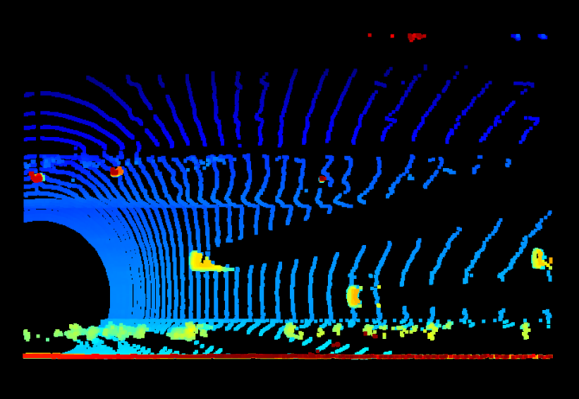

# Section 1 : Compute Lidar Point-Cloud from Range Image
## Visualize range image channels (ID_S1_EX1)
The Visualized range image is 

## Visualize lidar point-cloud (ID_S1_EX2)
### Sample of the point cloud image is 

### 10 examples of vehicles with varying degrees of visibility in the point-cloud
|   |   | 
:-------------------------:|:-------------------------:
|  |  |
|  |  |
|  |  |
|  |  |
|  |  |

There are many vehicle features that appear stable in most of the inspected examples. for example overall shape, rear bumper, bonnet. In some examples, tyre and rear lights are also good vehicle features.

# Section 2 : Create Birds-Eye View from Lidar PCL
## Convert sensor coordinates to BEV-map coordinates (ID_S2_EX1)

## Compute intensity layer of the BEV map (ID_S2_EX2)

## Compute height layer of the BEV map (ID_S2_EX3)

# Section 3 : Model-based Object Detection in BEV Image
## Add a second model from a GitHub repo (ID_S3_EX1)
## Extract 3D bounding boxes from model response (ID_S3_EX2)

# Section 4 : Performance Evaluation for Object Detection
## Compute intersection-over-union between labels and detections (ID_S4_EX1)
**ious**: [0.9120538349785395, 0.8760647072678955]

**center_devs**: [[-0.0722, 0.0284, 0.8152483974641882], [0.0598, -0.0070, 0.8711946193956237]]

## Compute false-negatives and false-positives (ID_S4_EX2)
**det_performance**: [[0.9120538349785395, 0.8760647072678955], [[-0.0722, 0.0284, 0.8152483974641882], [0.0598, -0.0070, 0.8711946193956237]], [3, 2, 1, 0]]

## Compute precision and recall (ID_S4_EX3)
**precision** = 0.9691780821917808, **recall** = 0.9248366013071896

### Result for configs_det.use_labels_as_objects
**precision** = 1.0, **recall** = 1.0

